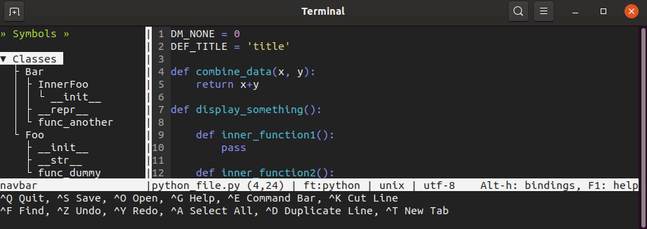

# Micro Navbar Plugin



*Written in Lua* (Notes: micro seems to be using lua-5.1 and not the latest lua version lua-5.3)

Navigation bar (class and functions) for micro editor (strongly influenced by the design of the filemanager plugin for micro).

There are 3 styles defined to display the tree: 'bare', 'ascii' and 'box'
```
* 'bare' style *

v Classes               > Classes
  v TestClass1            > TestClass1
    . __init__            . TestClass2
    . __str__           > Functions
  . TestClass2          > Variables
v Functions
  . TestFunction
v Variables
  . TestVariable


* 'ascii' style *

- Classes               - Classes
  - TestClass1            + TestClass1
  | . __init__            L TestClass2
  | L __str__           + Functions
  L TestClass2          + Variables
- Functions
  L TestFunction
- Variables
  L TestVariable


* 'box' style *

▾ Classes               ▾ Classes
  ├ TestClass1            ╞ TestClass1
  │ ├ __init__            └ TestClass2
  │ └ __str__           ▸ Functions
  └ TestClass2          ▸ Variables
▾ Functions
  └ TestFunction
▾ Variables
  └ TestVariable
```

Supported Languages
-------------------
Notes:
- For the current version, I am using a line parser with some regular expressions. I am aware such parser has a lot of limitations, but this is good enough for a MVP (minimum viable product) and for my current needs. Ideally we should be using a proper parser such as tree-sitter (someone is working on integrating it with micro for the syntax highlighting, and maybe we coould piggy-back on the effort for this plugin). If you want more langages to be supported at the moment, you need to contribute a basic parser like the one I wrote for the python and lua languages.

- Python: Python is a fairly rigid programming language (through the use of indentation, etc.) and the line parser should do the job in most situations.

- Lua : Lua is a fairly flexible programming language. It supports object oriented programming but not at the language level (meaning there are multiple ways to implement classes). So, I resorted to write a line parser (a bit of a hack) and it should work as long as your write "clean" code (if your code looks more like python actually). It will return poor results (not display all data) if your program looks like the result of a minifier (a program on a single line) or if you use inner functions (functions defines directly inside a table for example).


Supported Platforms
-------------------
This plugin has been developped under linux. It should work on most unix/linux derrivative (such as termux on android). It has not been tested on MacOS nor on Windows. Feel free to contribute to support these platforms.


Settings
--------
- openonstart: bool (true or false), set to true to open when micro is open. Default to false.
- softwrap: bool (true or false), set to true to use wrapping in the treeview window. Default to false.
- persistent: bool (true or false), set to true to have the list of closed nodes be persistent when closing/opening micro.
- treestyle: string ('bare', 'ascii', 'box'), the style to use to display the tree. Default to 'bare'.
- treestyle_spacing: int (0, 1, etc.), the number of extra-characters to use for the tree branch. Default to 0.
- treeview_rune_close_all: string (single letter), the key to use in the tree_view to close all nodes. Default to 'c'.
- treeview_rune_goto: string (single letter), the key to use in the tree_view to move the cursor in the main_view to the corresponding item. Default to 'g'.
- treeview_rune_open_all: string (single letter), the key to use in the tree_view to open all nodes. Default to 'o'.
- treeview_rune_toggle: string (single letter), the key to use in the tree_view to toggle a node with children between open and closed. Default to ' ' (space bar).


BUGS
----
- When the window's height is smaller than the display_content, Opening/closing items causes the menu to jump in the sidebar (cause by function to position code in the middle).
- When jumping to 'combine_data', the selected line is not being displayed on screen (although it is being selected).
- Small terminal (15 lines), open file, close_all, open_all, close_all, buffer is weird. Need arrow up/down to display header.

TODO
----
- Provide better mouse support.
- Integrate with a proper parser like tree-sitter to extract the symbols: objects, classes, functions, variables, constants, etc.
